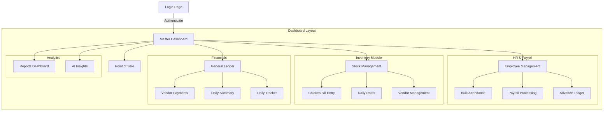
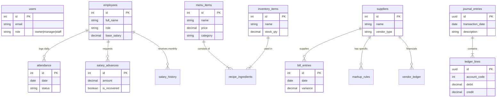

# System Architecture Overview

> [!NOTE]
> This document uses **Mermaid** for diagrams.
> - **In VS Code:** Press `Ctrl+Shift+V` (or `Cmd+Shift+V` on Mac) to open the Markdown Preview, which renders the graphs.
> - **In GitHub:** The diagrams will render automatically.
> - **Online:** You can copy the code blocks into the [Mermaid Live Editor](https://mermaid.live).

## 1. Page Navigation Map (Sitemap)

This diagram shows how the application pages are connected and structured within the dashboard.

## 2. Entity Relationship Diagram (ERD)

This diagram illustrates how data is structured and related in the database.

## 3. Data Flow & Page Connections

-   **POS System**:
    -   Reads from `menu_items`.
    -   Creates `journal_entries` (Revenue) and `ledger_lines`.
    -   Updates `inventory_items` via `recipe_ingredients`.

-   **HR & Payroll**:
    -   **Employees Page**: Manages `employees`.
    -   **Attendance Page**: Writes to `attendance`.
    -   **Advances Page**: Writes to `salary_advances` and `journal_entries`.
    -   **Payroll Page**: Reads `attendance` & `salary_advances`, creates `salary_history` and `journal_entries` (Expense).

-   **Chicken Tracker (Inventory)**:
    -   **Daily Rates Page**: Writes to `daily_rates`.
    -   **Bill Entry Page**: Reads `suppliers` & `markup_rules`, writes to `bill_entries` and `vendor_ledger`.

-   **Finance Module**:
    -   **General Ledger**: Aggregates `journal_entries` & `ledger_lines`.
    -   **Vendor Payments**: Updates `vendor_ledger` and creates `journal_entries`.
