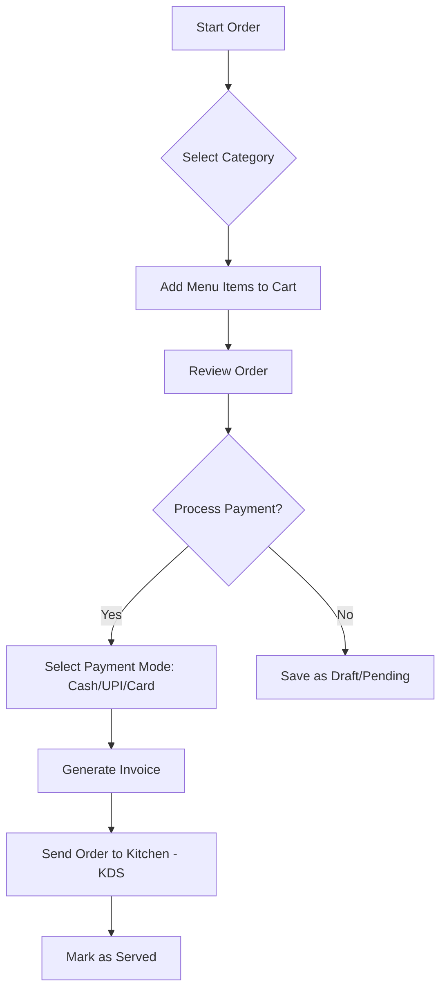
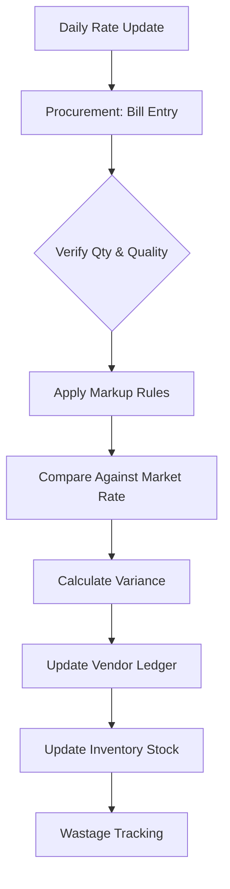
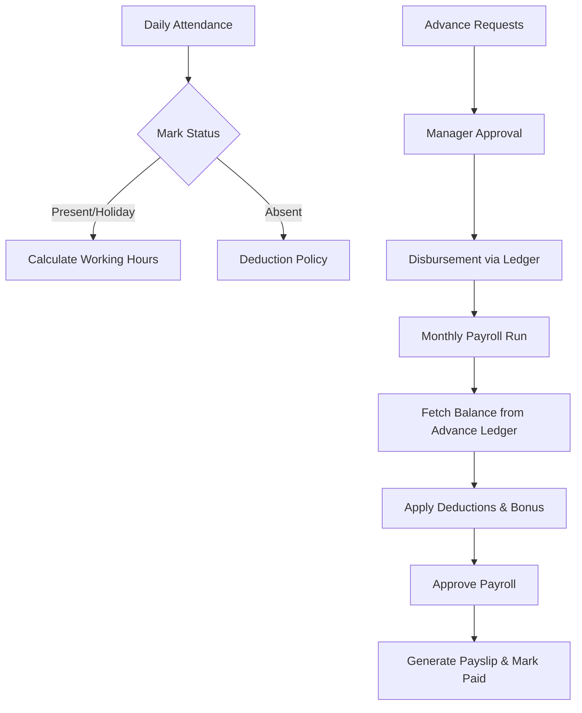
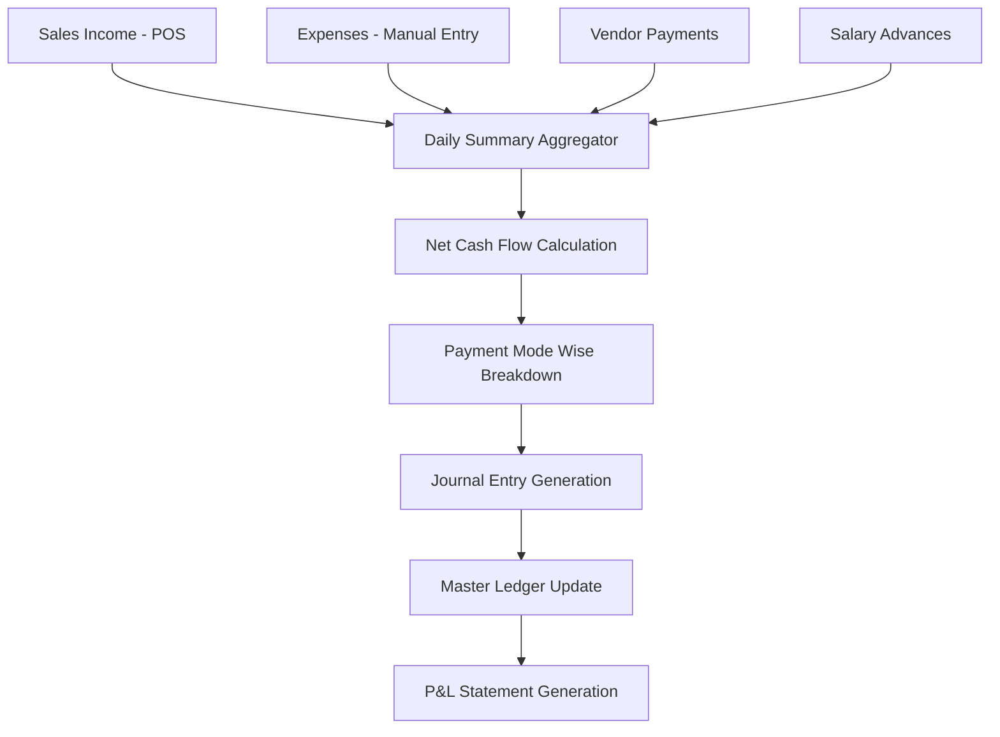
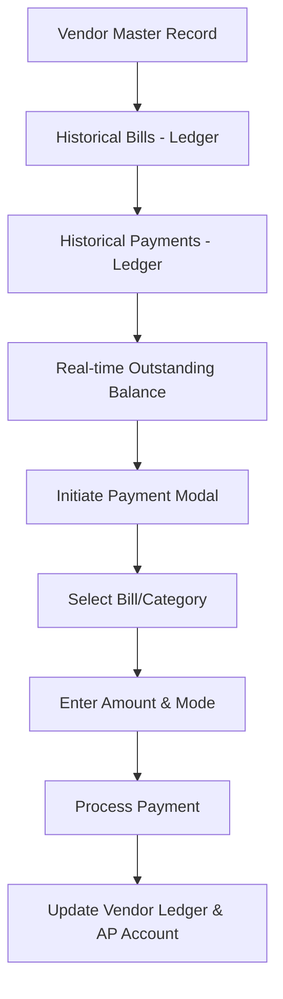

# Al Zohra RMS v2 - Module Flowcharts

This document provides visual flowcharts for the core modules of the system to facilitate better understanding of the operational workflows.

## 1. POS & Order Management

## 2. Inventory & Chicken Tracking

## 3. HR, Attendance & Payroll

## 4. Financial Ledger & Daily Summary

## 5. Vendor Payments & Outstanding

